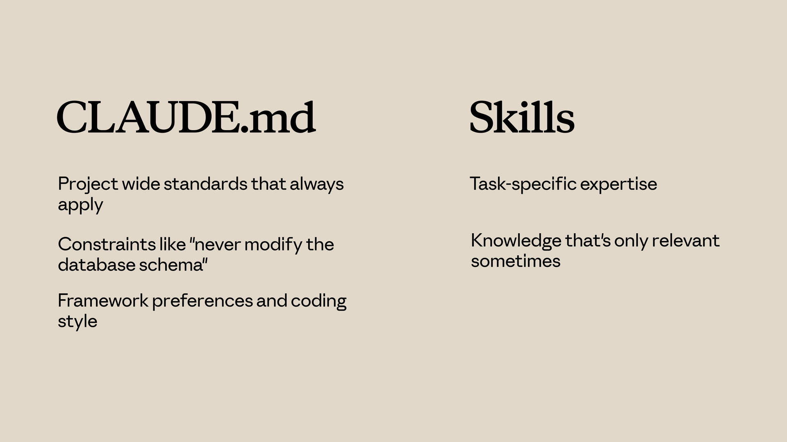
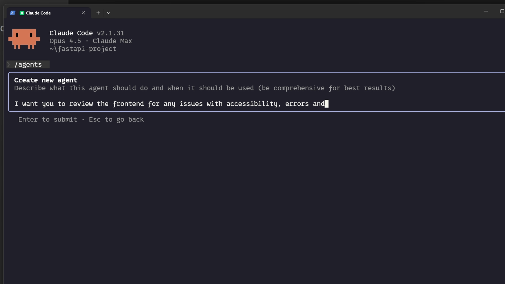

# Skills

Skills are reusable prompt templates that let you encode recurring tasks, team conventions, and workflows into short, invocable commands. Instead of re-typing the same instructions every session, you define them once and invoke them with a `/` prefix.

Claude Code has the most mature built-in support for skills. Other tools offer partial equivalents, which are covered in the [Using skills with other tools](#using-skills-with-other-tools) section below.

## What are skills?

In Claude Code, a skill is a directory whose main file is `SKILL.md`. Claude Code loads skills from `.claude/skills/` (and from your user-level skills directory; see [Skill priority](#skill-priority)). The **directory name** becomes the slash command: `.claude/skills/review/SKILL.md` is invoked as `/review`.

YAML frontmatter on `SKILL.md` carries the skill name and a short description so Claude can discover when it applies; the markdown body and any sibling files in the folder supply the instructions and supporting resources Claude loads on demand.

<figure style={{ margin: '1.5rem 0' }}>
  <div
    style={{
      position: 'relative',
      width: '100%',
      paddingBottom: '56.25%',
      height: 0,
      overflow: 'hidden',
    }}>
    <iframe
      style={{ position: 'absolute', top: 0, left: 0, width: '100%', height: '100%' }}
      src="https://www.youtube.com/embed/bjdBVZa66oU?si=JCaM8bjMd7s74PiS&controls=0"
      title="YouTube video player"
      frameBorder={0}
      allow="accelerometer; autoplay; clipboard-write; encrypted-media; gyroscope; picture-in-picture; web-share"
      referrerPolicy="strict-origin-when-cross-origin"
      allowFullScreen
    />
  </div>
  <figcaption
    style={{
      marginTop: '0.5rem',
      fontSize: '0.875rem',
      color: 'var(--ifm-color-emphasis-600)',
    }}>
    Video length: about 3 minutes
  </figcaption>
</figure>

## Creating your first skill

In this walkthrough you build a skill from the ground up (the steps use a `review` skill; the same layout works for a PR description flow or any other command). It shows how to shape `SKILL.md`, invoke the skill with `/review`, and how Claude picks a skill from what you ask. [Skill priority](#skill-priority) explains which definition wins when two skills share a name.

<figure style={{ margin: '1.5rem 0' }}>
  <div
    style={{
      position: 'relative',
      width: '100%',
      paddingBottom: '56.25%',
      height: 0,
      overflow: 'hidden',
    }}>
    <iframe
      style={{ position: 'absolute', top: 0, left: 0, width: '100%', height: '100%' }}
      src="https://www.youtube.com/embed/Wx6_vjFFyHM?si=L-Y_QaFcbet3IBaM&controls=0"
      title="YouTube video player"
      frameBorder={0}
      allow="accelerometer; autoplay; clipboard-write; encrypted-media; gyroscope; picture-in-picture; web-share"
      referrerPolicy="strict-origin-when-cross-origin"
      allowFullScreen
    />
  </div>
  <figcaption
    style={{
      marginTop: '0.5rem',
      fontSize: '0.875rem',
      color: 'var(--ifm-color-emphasis-600)',
    }}>
    Video length: about 4 minutes
  </figcaption>
</figure>

### Create the files

From the repository root, add a folder under `.claude/skills/` whose name will be your command (here, `review`):

```bash
mkdir -p .claude/skills/review
```

Create `SKILL.md` inside it with YAML frontmatter and the body Claude should follow when the skill runs:

```markdown
# .claude/skills/review/SKILL.md
---
name: review
description: Review staged git changes for bugs, regressions, and missing tests
---

Review the staged git changes and provide a concise summary of:
- What was changed and why
- Any potential bugs or regressions introduced
- Missing tests or edge cases
- Whether the commit message accurately describes the changes
```

Invoke it in Claude Code:

```text
/review
```

The older flat-file format `.claude/commands/review.md` still works for backward compatibility. The **directory** format is recommended because it supports supporting files, scripts, and richer frontmatter (see [Configuration and multi-file skills](#configuration-and-multi-file-skills)).

### Skill priority

If two skills share the same name (for example, one in the repo and one under your home directory), Claude Code applies a single precedence chain. Items nearer the top override items below; for a given name, only the highest-listed source is used:

1. **Enterprise** (organization-managed settings)
2. **Personal** (`~/.claude/skills` on your machine)
3. **Project** (`.claude/skills` in the checked-out repository)
4. **Plugins** (skills that ship with installed plugins)

That order lets companies ship non-negotiable standards while individuals and teams can still add skills for everything else. If your org defines an enterprise `code-review` skill and you add a personal `code-review` skill, Claude uses the enterprise definition.

### Project-level vs user-level paths

| Location | Scope | Use case |
|---|---|---|
| `.claude/skills/<name>/SKILL.md` | Project-specific, shared via git | Team workflows, project conventions |
| `~/.claude/skills/<name>/SKILL.md` | Personal, all repositories | Your own recurring prompts |

Commit `.claude/skills/` to source control when you want the whole team to share the same definitions. Personal skills in `~/.claude/skills` stay on your machine and apply everywhere unless an enterprise or project skill with the same name wins the [precedence chain](#skill-priority) above.

## Configuration and multi-file skills

This walkthrough goes past the basics: the full metadata surface on `SKILL.md`, wording descriptions so invocation stays predictable, tightening which tools a skill may use for sensitive flows, and splitting large skills into supporting files so details load only when needed (progressive disclosure). The emphasis is stronger skills that still avoid loading instructions you are not using yet.

<figure style={{ margin: '1.5rem 0' }}>
  <div
    style={{
      position: 'relative',
      width: '100%',
      paddingBottom: '56.25%',
      height: 0,
      overflow: 'hidden',
    }}>
    <iframe
      style={{ position: 'absolute', top: 0, left: 0, width: '100%', height: '100%' }}
      src="https://www.youtube.com/embed/98KaK_rn5rQ?si=hwRWw0haxJVrrcj1&controls=0"
      title="YouTube video player"
      frameBorder={0}
      allow="accelerometer; autoplay; clipboard-write; encrypted-media; gyroscope; picture-in-picture; web-share"
      referrerPolicy="strict-origin-when-cross-origin"
      allowFullScreen
    />
  </div>
  <figcaption
    style={{
      marginTop: '0.5rem',
      fontSize: '0.875rem',
      color: 'var(--ifm-color-emphasis-600)',
    }}>
    Video length: about 4 minutes
  </figcaption>
</figure>

### Skill Metadata Fields

The open standard for Agent Skills defines YAML frontmatter keys in `SKILL.md`. Two keys are required; the rest are optional:

- **`name`** (required): Stable identifier for the skill. Use only lowercase letters, numbers, and hyphens, at most 64 characters, and align it with the skill directory name.
- **`description`** (required): Plain-language guidance for when Claude should load the skill, up to 1,024 characters. Claude leans on this field heavily for matching, so treat it as the primary tuning knob.
- **`allowed-tools`** (optional): Caps which tools Claude may call while the skill is active.
- **`model`** (optional): Selects which Claude model runs when this skill is in use.

### Using Scripts Efficiently

Helper scripts next to `SKILL.md` can run without dumping their full source into the model context. When Claude invokes them through the shell, you mostly pay tokens for what the process prints (and any errors you surface), not for the script body. In the skill instructions, say clearly to **run** the file, not to open it and summarize or rewrite it.

Strong fits include:

- Validating environments, credentials, or dependencies before work starts
- Fixed-format parsing, normalization, or small ETL steps you want identical every time
- Behavior you keep in versioned, tested code instead of re-deriving in the chat transcript


## Skills vs. other Claude Code features

Claude Code gives you several ways to steer behavior. If you mix the wrong ones, you duplicate rules or burn context for no gain. The subsections below contrast **skills** with `CLAUDE.md`, **subagents**, and **hooks**. For connecting to external tools and data, see [MCP](./mcp).

### CLAUDE.md vs Skills

`CLAUDE.md` is always on: it loads for every turn in that project. Example: if TypeScript strict mode should never be negotiable here, put it in `CLAUDE.md`.

<figure style={{ margin: '1.5rem 0' }}>
  <div
    style={{
      position: 'relative',
      width: '100%',
      paddingBottom: '56.25%',
      height: 0,
      overflow: 'hidden',
    }}>
    <iframe
      style={{ position: 'absolute', top: 0, left: 0, width: '100%', height: '100%' }}
      src="https://www.youtube.com/embed/IgNN4v0BJdU?si=3XLWVGfk60OUIP-O&controls=0"
      title="YouTube video player"
      frameBorder={0}
      allow="accelerometer; autoplay; clipboard-write; encrypted-media; gyroscope; picture-in-picture; web-share"
      referrerPolicy="strict-origin-when-cross-origin"
      allowFullScreen
    />
  </div>
  <figcaption
    style={{
      marginTop: '0.5rem',
      fontSize: '0.875rem',
      color: 'var(--ifm-color-emphasis-600)',
    }}>
    Video length: about 3 minutes
  </figcaption>
</figure>

**Skills** load only when they match the task. After a match, their instructions merge into the active conversation. A PR review rubric does not need to sit in context while you are implementing a feature; it can stay dormant until you ask for a review.

<div style={{textAlign: 'center'}}>
  
</div>

**Prefer `CLAUDE.md` when you need:**

- Project-wide standards that should always apply
- Hard constraints (for example, "never change the database schema without a migration")
- Framework choices, libraries, and house coding style

**Prefer skills when you need:**

- Task-specific playbooks or domain detail
- Knowledge that matters only for some requests
- Long procedures that would clutter every session if they lived in `CLAUDE.md`

### Skills vs Subagents

A **skill** augments the **current** session: when it activates, its text joins the same conversation you are already in.

A **subagent** runs in a **separate** session. You give it a brief, it works with its own context and tool policy, then it hands results back. That isolation is the point.

**Reach for subagents when:**

- The work should run in its own execution context, not inline with the main thread
- You want different tool access or a tighter scope than the main conversation
- You need a firewall between exploratory or risky work and your primary chat

**Reach for skills when:**

- You want extra instructions available inside the main conversation
- The guidance should apply across many turns in the same thread, not as a one-off delegation

### Skills vs Hooks

**Hooks** are **event-driven**: they run when something happens (for example, after a save, or before a tool call). Typical uses include linting, guards, or small automations tied to Claude's actions.

**Skills** are **request-driven**: they turn on from what you are trying to do and how the skill is described, not from a lifecycle hook firing.

**Prefer hooks when:**

- Something must run on every occurrence of an event (every save, every edit, and so on)
- You need validation or policy checks at specific tool boundaries
- You want side effects that do not belong in free-form instructions

**Prefer skills when:**

- You are shaping judgment: how to plan, review, or implement
- The content is guidance and examples, not a script tied to a single event

## Sharing skills

Skills compound when a team or organization runs the same definitions. This walkthrough compares three ways to ship them (commit `.claude/skills/` with the repo, package them in plugins, or push them through enterprise-managed settings), then shows how to attach skills to custom subagents. One sharp edge to internalize: subagents do not inherit skills from the main session unless you preload them explicitly.

<figure style={{ margin: '1.5rem 0' }}>
  <div
    style={{
      position: 'relative',
      width: '100%',
      paddingBottom: '56.25%',
      height: 0,
      overflow: 'hidden',
    }}>
    <iframe
      style={{ position: 'absolute', top: 0, left: 0, width: '100%', height: '100%' }}
      src="https://www.youtube.com/embed/OCBi3eScNLk?si=QPS0z1IxFUOaJ5H6&controls=0"
      title="YouTube video player"
      frameBorder={0}
      allow="accelerometer; autoplay; clipboard-write; encrypted-media; gyroscope; picture-in-picture; web-share"
      referrerPolicy="strict-origin-when-cross-origin"
      allowFullScreen
    />
  </div>
  <figcaption
    style={{
      marginTop: '0.5rem',
      fontSize: '0.875rem',
      color: 'var(--ifm-color-emphasis-600)',
    }}>
    Video length: about 4 minutes
  </figcaption>
</figure>

### Skills and Subagents

Subagents do **not** pick up skills just because the main chat already loaded them. Delegation starts a separate context, so anything the subagent should rely on has to be declared on that agent (or repeated in the task you send).


Keep three distinctions straight:

- **Built-in agent types** (for example Explore and Plan) are fixed presets. They do not preload your custom skill definitions from the repo the way a **custom** agent can with a `skills` list in frontmatter.
- **Custom agents** under `.claude/agents/` can preload skills, but only when you name them explicitly in YAML.
- **Preloaded skills** inject their full bodies at **agent startup**. That is different from the main conversation, where skills can be matched and loaded as the dialog moves.

Author the file under `.claude/agents/`, or run `/agents` in Claude Code and describe the role when prompted:

<div style={{textAlign: 'center'}}>
  
</div>

The scaffold includes a `skills` array listing which skill packages to load. Example frontmatter:

```yaml
---
name: frontend-security-accessibility-reviewer
description: "Use this agent when you need to review frontend code for accessibility..."
tools: Bash, Glob, Grep, Read, WebFetch, WebSearch, Skill...
model: sonnet
color: blue
skills: accessibility-audit, performance-check
---
```

After you delegate to that agent, both skill bodies stay in its context for the whole run. Create the skill folders first under `.claude/skills/` (or your user-level skills directory), then either generate a new agent with `/agents` or add `skills:` to an existing agent markdown file.

**Good fit when:**

- You want isolation **and** a stable bundle of expertise for that worker
- Different agents need different skill sets (frontend reviewer versus API reviewer, for example)
- You want checklists and conventions enforced in delegated work without pasting them into every prompt

See [Subagents](./subagents) for the full picture (built-in types, when to delegate, and tips). For agent files and `/agents`, jump to [Creating custom subagents](./subagents#creating-custom-subagents).


## Troubleshooting skills

<figure style={{ margin: '1.5rem 0' }}>
  <div
    style={{
      position: 'relative',
      width: '100%',
      paddingBottom: '56.25%',
      height: 0,
      overflow: 'hidden',
    }}>
    <iframe
      style={{ position: 'absolute', top: 0, left: 0, width: '100%', height: '100%' }}
      src="https://www.youtube.com/embed/YBa1cwaG7is?si=byrYi2skIgJ2n8Xq&controls=0"
      title="YouTube video player"
      frameBorder={0}
      allow="accelerometer; autoplay; clipboard-write; encrypted-media; gyroscope; picture-in-picture; web-share"
      referrerPolicy="strict-origin-when-cross-origin"
      allowFullScreen
    />
  </div>
  <figcaption
    style={{
      marginTop: '0.5rem',
      fontSize: '0.875rem',
      color: 'var(--ifm-color-emphasis-600)',
    }}>
    Video length: about 4 minutes
  </figcaption>
</figure>

When a skill misbehaves, it usually fits one of a few patterns: it never activates, it does not show up in the roster, Claude picks a different skill, or something breaks while the skill runs. Most fixes are small once you know which pattern you are seeing.

### Use the skills validator

Start with the agent skills verifier. Install steps depend on your OS; **`uv`** is often the quickest way to get a working install.

Run it against your skill directory (or from the project root, if the tool allows). It flags structural issues up front so you do not burn time debugging the wrong layer.

### Skill does not trigger

The skill validates, but Claude does not apply it when you think it should. The usual cause is the **`description`** field in `SKILL.md` frontmatter.

Matching is semantic: your chat wording has to overlap what the description claims the skill is for. Weak overlap means no match.

- Align the description with how you (and teammates) actually phrase requests.
- Add concrete trigger phrases people would say out loud.
- Try variants such as "help me profile this," "why is this slow?," and "make this faster."
- If a variant never pulls the skill in, add those terms to the description.

### Skill does not load

If Claude omits the skill when you ask what is available, check layout and naming first:

- **`SKILL.md` must sit inside a named folder** under the skills root, not alone at the root beside other skills.
- The filename must be exactly **`SKILL.md`**: `SKILL` in all caps, extension `.md` in lowercase.

For loader errors, run:

```bash
claude --debug
```

Watch the log for lines that mention your skill name; they often point straight at the fault.

### Wrong skill gets used

Claude reaches for a different skill or wavers between two. Descriptions are probably too close in meaning. Narrow and differentiate them so scope and triggers are obvious. Specific descriptions improve routing and cut down collisions with similar skills.

### Plugin skills do not appear

You installed a plugin but its skills never show up.

- Clear the Claude Code cache, restart Claude Code, then reinstall the plugin.
- If skills are still missing, the plugin bundle layout may not match what Claude Code expects. This is a good time to run the skills validator, or compare the plugin against a known-good package.

### Runtime errors

The skill loads but fails while it runs. Typical causes:

- **Missing dependencies:** If the skill relies on external packages, they must be installed in the environment where Claude runs the skill. Document requirements in the skill body or description so Claude and humans know what to install.
- **Permissions:** Scripts need execute permission. Example:

```bash
chmod +x path/to/your-script.sh
```

- **Path separators:** Prefer forward slashes in paths even on Windows so references behave the same everywhere.

### Quick troubleshooting checklist

- **Never triggers:** Improve `description` and add trigger phrases you actually use in chat.
- **Does not load:** Check folder layout, exact `SKILL.md` filename, and YAML frontmatter syntax.
- **Wrong skill:** Make overlapping descriptions more distinct.
- **Shadowed:** Two definitions can share a name; only the winner in the precedence chain applies. See [Skill priority](#skill-priority) and rename or consolidate if needed.
- **Plugin skills missing:** Clear cache, restart, reinstall; then validate plugin structure.
- **Runtime failure:** Dependencies, executable bits on scripts, and path style.

## Do you need skills?

You don't strictly need skills to use Claude Code. You can chat, run subagents, and edit code without them. But once you use them, it's hard to go back, because they solve the most common frustrations people hit after the first few days.

| Without skills | With skills |
|---|---|
| Repeating the same instructions every session ("always use Tailwind dark mode", "follow our security checklist") | Claude applies your rules automatically when relevant |
| Results vary from session to session | Consistent, repeatable output every time |
| Long `CLAUDE.md` files that eat into your context window | Instructions load only when needed, on demand |
| Subagents starting from scratch every time | Skills can preload into any subagent, giving it your rules from the start |

The short version: skills are reusable expert recipes that Claude keeps in its back pocket and pulls out when the task matches. Subagents are the specialist workers you assign tasks to. Most people end up using both together.

## Context mechanisms in Claude Code

Claude Code has four overlapping ways to give it persistent context and instructions. Understanding how they differ helps you put the right information in the right place.

| | CLAUDE.md | Subagents | Commands | Skills |
|---|---|---|---|---|
| Auto-loaded every session | Yes | No | No | No (invoked on demand) |
| Token cost | Always in context | Per-session, isolated | Loaded at invocation | Loaded at invocation |
| Can execute tools / run code | No | Yes | Yes | Yes |
| Shareable via git | Yes | Yes (`.claude/agents/`) | Yes (`.claude/commands/`) | Yes (`.claude/skills/`) |
| Best for | Project-wide rules that always apply | Delegating isolated specialist tasks | Reusable prompt workflows | Reusable prompt workflows |

<div style={{textAlign: 'center'}}>
  
</div>

In Claude Code, **Commands and Skills have merged**: skills live in `.claude/skills/<skill-name>/SKILL.md`, while the older `.claude/commands/<name>.md` format still works for backward compatibility. Both create the same `/slash-command`. Skills are recommended because they support additional features: a directory for supporting files, frontmatter to control invocation, and automatic loading by Claude when relevant.

### Preloaded skills vs. on-demand skills

Skills can be used in two fundamentally different ways:

**On-demand skills** (the default) are invoked explicitly by the user or by a command using `/skill-name`. They load into context only when called.

**Preloaded (agent) skills** are specified in a subagent's frontmatter via the `skills` field. Their full content is injected into the agent's context at startup, giving the agent background knowledge without needing to invoke anything:

```yaml
# .claude/agents/api-builder.md
---
name: api-builder
skills: ["rest-conventions", "error-handling-patterns"]
---
Build API endpoints following our conventions.
```

The api-builder agent starts every session already knowing your REST conventions and error handling patterns. It does not need to call `/rest-conventions`; the knowledge is already in its context.

**When to use which:**
- **On-demand**: workflows you invoke for a specific task (review, scaffold, generate tests)
- **Preloaded**: domain knowledge and conventions that an agent needs for every task it handles

For more on how commands, agents, and skills compose together, see [Workflows & Orchestration](./workflows).

A practical rule of thumb:
- **CLAUDE.md**: conventions, constraints, and background context that should always be active
- **Skills (commands)**: workflows and prompt recipes that you invoke for a specific task
- **Subagents**: isolated specialist workers for noisy or expensive subtasks

## Ready-to-use skills

Copy any of these into `.claude/skills/<name>/SKILL.md` (project) or `~/.claude/skills/<name>/SKILL.md` (user-wide). Each file is also available to download directly.

---

### Universal

These work well in any codebase regardless of stack or language.

#### review

[Download review.md](pathname:///skills/review.md): staged diff review with severity-grouped findings

Runs `git diff --staged` (or the last commit if nothing is staged) and reviews for logic bugs, security vulnerabilities, missing error handling, performance regressions, and style inconsistencies. Reports findings grouped by severity (Critical, High, Medium, Low) with file, line, description, and suggested fix.

#### pr-desc

[Download pr-desc.md](pathname:///skills/pr-desc.md): GitHub/GitLab-ready PR title and body from branch diff

Compares the current branch against main using `git log` and `git diff --stat`, reads the most relevant changed files, and generates a Markdown PR description with title, summary bullets, file-by-file changes, test plan checklist, and notes section.

---

### Web & backend

Focused on API quality, environment configuration, and database safety.

#### api-review

[Download api-review.md](pathname:///skills/api-review.md): validation, HTTP semantics, auth, and consistency review

Accepts a path (or scans all route handlers) and checks each endpoint for input validation, correct HTTP methods and status codes, error handling that does not leak internals, auth/authorization on protected routes, and design consistency (naming, pagination, rate limiting). Reports grouped by category.

#### env-check

[Download env-check.md](pathname:///skills/env-check.md): missing .env.example entries, committed secrets, unvalidated variables

Audits all environment files and every place in code where env vars are accessed. Reports missing `.env.example` entries, committed secrets, variables read without validation or fallback, inconsistent naming, and unused variables.

#### db-review

[Download db-review.md](pathname:///skills/db-review.md): SQL injection, N+1 queries, schema design, and migration safety

Accepts a path (or finds all database-related files) and checks for raw SQL injection risks, N+1 query patterns, missing indexes, schema design issues (nullability, foreign keys, varchar limits), unsafe migrations, and missing transactions. Findings rated Critical through Low.

---

### Testing

For finding gaps in test coverage and generating new tests quickly.

#### test-gaps

[Download test-gaps.md](pathname:///skills/test-gaps.md): untested files, functions, missing edge cases, and test quality issues

Accepts a path (or analyzes the whole project). Finds source files with no tests, functions with no coverage, tests that only cover the happy path, and tests that pass for the wrong reason. Ends with the top 5 recommended test cases by risk and an overall coverage rating.

#### gen-tests

[Download gen-tests.md](pathname:///skills/gen-tests.md): generates a complete test file matching the existing framework and style

Accepts a file or function, detects the test framework already in use, and writes tests covering happy path, edge cases (empty, null, boundary), error conditions, and conditional branches. Matches existing naming conventions, assertion style, and directory structure.

---

### Documentation

For generating and maintaining inline docs.

#### doc-this

[Download doc-this.md](pathname:///skills/doc-this.md): generates missing JSDoc, docstrings, or language-native docs to match the existing style

Accepts a file, detects the documentation style already in use (JSDoc, Python docstrings, Go/Rust doc comments), and adds missing documentation for all exported or public functions, methods, classes, and types. Skips trivial getters/setters and does not rewrite existing docs.

---

### Planning & workflow

For product planning, requirements, and multi-agent coordination.

#### write-prd

[Download write-prd.md](pathname:///skills/write-prd.md): structured PRD generation using a 7-document template system

Interviews the user to determine feature size (small, medium, large, complex), then generates the appropriate subset of documents: INDEX, OVERVIEW, BUSINESS-LOGIC, DATABASE-SCHEMA, API-ENDPOINTS, IMPLEMENTATION, and IMPLEMENTATION-STEPS. Each document follows a fixed template with placeholders, so the output is ready for an AI coding session or a human reviewer.

#### product-vision

[Download product-vision.md](pathname:///skills/product-vision.md): guided product vision with Jira-ready epic descriptions

Runs a 5-round interview (idea, strategy, capabilities, metrics, review) and produces two files: a PRODUCT-VISION.md covering problem space, strategy, capabilities, success metrics, and roadmap, plus a JIRA-EPICS.md with copy-paste-ready epic blocks. Designed as the strategic layer above write-prd: each capability in the vision becomes a separate PRD.

#### agent-team-prompt

[Download agent-team-prompt.md](pathname:///skills/agent-team-prompt.md): Claude Code agent team spawning prompt generator

Reads the project's PRD (if one exists), interviews the user about team size, roles, and coordination mode (tmux or in-process), then generates a plain-text spawning prompt saved to `.claude/prompts/`. The output defines agents, model tiers (opus/sonnet/haiku), signal/wait chains, and coordination rules, ready to paste into the lead agent's first message.

---

## Finding more skills

The skills on this page are a starting point. There are two good places to discover more.

### Official: Anthropic Skills repository

The [anthropics/skills](https://github.com/anthropics/skills) repository on GitHub is Anthropic's official collection of agent skills. It includes production-quality examples across several categories: document creation (DOCX, PDF, PPTX, XLSX), creative and design tasks, web app testing, MCP server generation, and more. Each skill follows the `SKILL.md` format with YAML frontmatter (`name` and `description`) and structured instructions.

You can install skills from this repo directly in Claude Code:

```bash
/plugin marketplace add anthropics/skills
/plugin install document-skills@anthropic-agent-skills
```

The repository also contains a [skill template](https://github.com/anthropics/skills/tree/main/template) and the [Agent Skills specification](https://github.com/anthropics/skills/tree/main/spec), which are useful references if you want to author your own skills in the standard format.

### Community: Skills Marketplace (SkillsMP)

The community-maintained [Skills Marketplace (SkillsMP)](https://skillsmp.com/) aggregates over 270,000 agent skills from public GitHub repositories. It covers Claude Code, OpenAI Codex CLI, and ChatGPT, and provides search, category filtering, and quality indicators to help you find what you need.

A few things to keep in mind when using community skills:

- **Review before installing.** Community skills are open-source code from GitHub. Treat them the same way you would treat any third-party dependency: read the source before adding it to your project or home directory.
- **SkillsMP is not affiliated with Anthropic.** It is an independent community project.
- **Quality varies.** SkillsMP filters out repositories with fewer than 2 stars, but that is a low bar. Check that a skill does what you expect before relying on it.

## Using skills with other tools

The concept of a persistent, invocable prompt template does not map identically to every tool. Claude Code has native support; other tools require workarounds. See each tool's page for detailed setup instructions:

- [OpenAI Codex CLI: Skills and reusable prompts](../tools/codex#skills-and-reusable-prompts)
- [Cursor: Skills and reusable prompts](../tools/cursor#skills-and-reusable-prompts)
- [Gemini CLI: Skills and reusable prompts](../tools/gemini-cli#skills-and-reusable-prompts)

### Summary: skills support across tools

| Tool | Built-in skills / slash commands | Project-level sharing | Closest alternative |
|---|---|---|---|
| Claude Code | Yes (`.claude/skills/<name>/SKILL.md`) | Yes (committed to git) | Native feature |
| Codex CLI | No | No | Shell wrappers + shared prompts dir |
| Cursor | No (built-ins only) | No | Notepads, `.cursorrules` |
| Gemini CLI | No | Via `GEMINI.md` (context only) | Shell wrappers + prompts dir |
| Grok CLI | No | No | Shell wrappers + prompts dir |

If your team relies heavily on shared, reusable prompts, Claude Code's native skills system is the most ergonomic option. For other tools, the pattern of storing prompts as files in your repository and loading them via shell scripts achieves a similar result with more manual setup.
